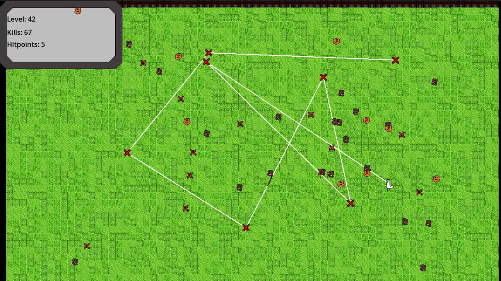

# Path Drawer

Is a simple game made with [Godot](https://godotengine.org/) 4.2.1. Goal of this game is to defend yourself from the enemies by using your Yaka Arrow. With each dying enemy you will gain points which will increase the number of maximum enemies at once. The player has to stay alive as long as possible.

The game is developed and published for Windows PCs.

Theoretically you should be able to run the game on any other operating system by downloading the repository and importing it as a project into Godot.

## Controls

| Action                   |                Keybinding                |
| ------------------------ | :--------------------------------------: |
| Move Up                  |                    W                     |
| Move Left                |                    A                     |
| Move Down                |                    S                     |
| Move Right               |                    D                     |
| Add Point for Yaka Arrow |             Mouse Left Click             |
| Send Yaka Arrow          |            Mouse Right Click             |
| Abort current Path       | Mouse Right Click if Yaka Arrow was send |
| Cancel current Run       |                  Escape                  |

## License
The game and all it's Assets are released under MIT License. You can find the full License [here](LICENSE.md).
